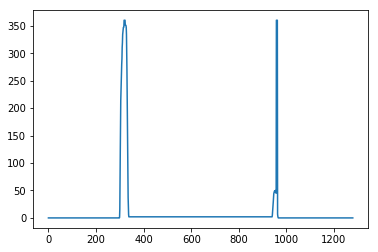

# Advanced Lane Finding Project

The goals / steps of this project are the following:

* Compute the camera calibration matrix and distortion coefficients given a set of chessboard images.
* Apply a distortion correction to raw images.
* Use color transforms, gradients, etc., to create a thresholded binary image.
* Apply a perspective transform to rectify binary image ("birds-eye view").
* Detect lane pixels and fit to find the lane boundary.
* Determine the curvature of the lane and vehicle position with respect to center.
* Warp the detected lane boundaries back onto the original image.
* Output visual display of the lane boundaries and numerical estimation of lane curvature and vehicle position.

---
## 1. Compute Camera Calibration using chessboard images

Image distortion occurs when a camera looks at 3D objects in the real world and transforms them into a 2D image; this transformation isn’t perfect. Distortion actually changes what the shape and size of these 3D objects appear to be. So, the first step in analyzing camera images, is to undo this distortion so that it we can get correct and useful information out of them

I prepare "object points", which will be the 3D coordinates of the chessboard corners in the world. Here the given chessboard images has fixed on the 2D(9, 6) plane at z=0, such that the object points are the same for each calibration image. Thus, objp is just a replicated array of coordinates, and objpoints will be appended with a copy of it every time I successfully detect all chessboard corners in a test image. imgpoints will be appended with the (x, y) pixel position of each of the corners in the image plane with each successful chessboard detection.

I then used the output objpoints and imgpoints to compute the camera calibration and distortion coefficients using the cv2.calibrateCamera() function. I applied this distortion correction to the test image using the cv2.undistort() function and obtained this result:
### Compute object and image points

see line 1-32 of above section on file CarND-Advanced-Lane-Lines.ipynb

### Calibrate the Camera

see line 1-10 of above section on file CarND-Advanced-Lane-Lines.ipynb

## 2.  Provide an example of a distortion-corrected image 

Use the distortion coffecient, cameera matrix mtx ( to transform 3D objects points to 2D image points), rotation and translation vector calculated above to undistort the test images from the 'test_images' folder by calling the 
cv2.undistort function as bellow.

see line 1-22 of above section on file CarND-Advanced-Lane-Lines.ipynb

## 3. perspective transform with an example of a transformed image.

A perspective transform maps the points in a given image to different, desired, image points with a new perspective. This will be useful for calculating the lane curvature later on.

The code for my perspective transform includes a function called warper(), which appears in lines 1 through 18 above. The warper() function takes as inputs an image (img), as well as source (src) and destination (dst) points. I chose the hardcode the source and destination points in the following manner:

see line 1-18 of above section on file CarND-Advanced-Lane-Lines.ipynb

I verified that my perspective transform was working as expected by drawing the src and dst points onto a test image and its warped counterpart to verify that the lines appear parallel in the warped image as above

## 4. Color transforms, Gradients or other methods to create a thresholded binary image

I used a combination of color and gradient thresholds to generate a binary image (bellow). Althouhg I tried with differen combination such as direction gradient, magnituted gradient, sobel x gradient, HLS color gradient I find 
sobel x gradient, S-color gradient, L-color gradient from HLS are usefull for this exercise specially the L-color threshold was really usefull in detecting the shadow on the road (from flyover, lane crack repair etc.) and overcome them.

Here's an example of my output for this step. 

see line 1-96 of above section on file CarND-Advanced-Lane-Lines.ipynb

## 5. Identify lane-line pixels and fit their positions with a polynomial

Here I take the histogram of a binary warped image along the y-axis and take half of the histogram to detect left lane pixels and the remaining half to detect right lane pixels. Then use a sliding window to find the non-zero left and right indices of x and y of the detected lane pixels and from there fit the coordinates of x and y into a second order polynomial equation and return the left and right coefficients along with the detected non-zero indices.

see line 1-93 of above section on file CarND-Advanced-Lane-Lines.ipynb

Draw the line through the detected lane pixels using the above fitted coefficients(A, B and C) for left and
right fit.
see line 1-29 , function draw_lanes_and_lines,  on file CarND-Advanced-Lane-Lines.ipynb

# 6.  Calculated the radius of curvature of the lane and the position of the vehicle with respect to center. 
I use the following equation to find the radius of curvature for detected left and right lanes
f'(y)= dx/dy = 2Ay+B
f′′(y)= d2x/dy2 = 2A
and Radius of curve = ((1+(2Ay+B)**2)**1.5)/|2A|

Given the binary warped image, left and right indices of detected lanes and the left and right coefficients of the fitted lines, the corresponding x and y coordinates in pixel value were derived. Then use the conversion ratio (from pixel to meter) devive the fitted coefficients(A, B, C) again in meters and from there use the equation above to derive radius of curvature for left and right lane in meter. Aslo from bottom Ys (left and right of the image,close to car dashboard) find the Xs coordinate and derive the middle lane line. Then find the position of the vehicle by taking the absolute difference between the middle of image and the middle lane line above.
I also return the bottom left and right x-coordinate of the lanes to find the space between the lanes which will be used to correct the detection later on.
 

    2443.54213985 m 1729.52437842 m 0.0139764059536 center distance bottom left x: 322.26743961 bottom right x: 952.444190569

see line 1-93 of above section, function find_radius_of_curvature  on file CarND-Advanced-Lane-Lines.ipynb

## 7. Provide an example image of the result plotted back down onto the road such that the          lane area is identified clearly.

see line 1-32 of above section on file CarND-Advanced-Lane-Lines.ipynb

Draw some usefull information such as left and right lane curvature, space between lanes etc.
This was visually observed to tune the detection and draw the lines.

## 8. Pipeline to process the image.

Here for each frame (input) of the video first it undistorts the image, do a perspective transform ,
then apply color and gradient thresholds to create a binary image. This function also return the inverse perspective transform matrix which will be used to draw the lanes.
see line 1-13 of above section on file CarND-Advanced-Lane-Lines.ipynb

Here's a link to my [Project_video.mp4](./project_video.mp4)

Here's a link to  [Challenge_video.mp4](./challenge_video.mp4)

### Discussion

I found L color gradient (of HLS) threshold play an important role for differentiating the lanes specially on shadow region or from parallel dark crack lines. I tried Magnitude gradient and directional threshold but wasn't that usefull. I think there are still a better way than my thresholded binary image to detect the lane even more appropriately, which is required to make it work for the 3rd video harder_challenge_video. Also I could have better tune the Challenge_video by tuning the sobel x threshold or introduce a y threshold.

